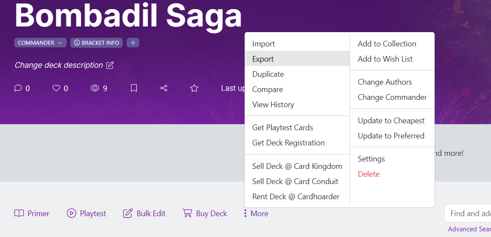

# MTG helper scripts

## CardTrader optimizer

- Install package manager
  - `sudo apt-get install poetry`
- Install environment
  - `poetry install`
- Run script
  - Export from moxfield using the MTGO option which provides card names and quantity in a format that is supported.
  - Modify the card list at the top of the `cardtrader_optimizer.py` file by adding your exported list.
  - Modify all other options of expansion, foil, language and condition
  - `poetry shell`
  - `python cardtrader_optimizer/cardtrader_optimizer.py`
  

### Export from moxfield

